# Collab Session – Real-time Code Sharing in Class

## Overview
**Collab Session** is a Visual Studio Code extension with a Node.js WebSocket backend.  
It enables **lecturers** to create live coding sessions and **students** to participate in real time.  

Key capabilities:
- Host can create sessions and set coding questions.  
- Students can join sessions, submit answers, and receive feedback.  
- Host can review answers, track connected users, and close sessions.  

---

## Requirements
- [Node.js](https://nodejs.org/) (version 18 or later)  
- [Visual Studio Code](https://code.visualstudio.com/)  

---

## Setup & Execution

### 1. Start the Server
Run the WebSocket server from the project root:

**Linux / macOS**
<!-- ```bash -->
node server.js
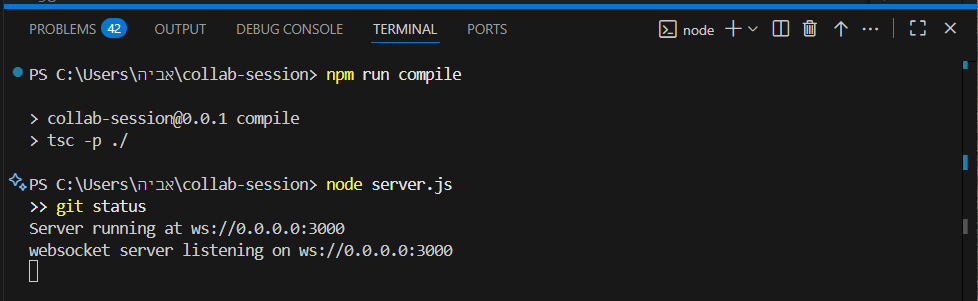
Windows PowerShell
    node server.js
The server starts on ws://localhost:3000.

2. Launch the Extension
    1.Open the project in Visual Studio Code.
    2.Press F5 (Run Extension).
    3.A new VS Code window opens with the extension activated.
    4.The extension automatically connects to ws://localhost:3000.

Usage
Typical Workflow

1.Host (Lecturer)
    1.Create a session (session ID is auto-copied).
    2.Share the session ID with students.
    3.Set a coding question.

2.Students
    1.Join the session with ID and name.
    2.Open a file, edit their solution, and send their answer.

3.Host
    1.View student submissions in real time.
    2.Provide individual feedback.
    3.Close the session once complete.

Extension Commands
All commands are accessible from the Command Palette (Ctrl+Shift+P / Cmd+Shift+P):
| Command                                 | Role           | Description                                        |
| --------------------------------------- | -------------- | -------------------------------------------------- |
| **Collab Session: Show Home**           | Host & Student | Opens the main panel (create/join session).        |
| **Collab Session: Create Session**      | Host           | Creates a new session and copies the ID.           |
| **Collab Session: Join Session**        | Student        | Joins a session by ID and name.                    |
| **Collab Session: Set Question**        | Host           | Shares a coding question with students.            |
| **Collab Session: Send My Answer**      | Student        | Sends the content of the current file to the host. |
| **Collab Session: Open Student Answer** | Host           | Opens a student’s submitted code.                  |
| **Collab Session: Send Feedback**       | Host           | Sends text feedback to a student.                  |
| **Collab Session: Copy Session ID**     | Host           | Copies the current session ID to clipboard.        |
| **Collab Session: Leave Session**       | Student        | Disconnects from the current session.              |
| **Collab Session: Close Session**       | Host           | Ends the session and disconnects all users.        |

Notes
    Default configuration uses localhost:3000.
    No code changes are required for standard usage.
    Multi-device use is possible by replacing localhost with the server’s IPv4.

<!-- ```markdown -->
## Screenshots
### 1. Start the Server
  
Start the WebSocket server using Node.js.

### 2. Run the Extension
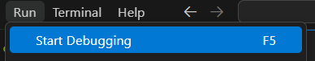  
Run the VS Code extension with **F5**.

### 3. Home Panel
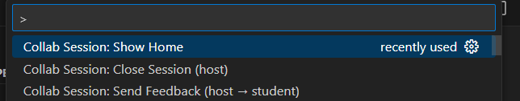  
Command palette option: *Collab Session: Show Home*.

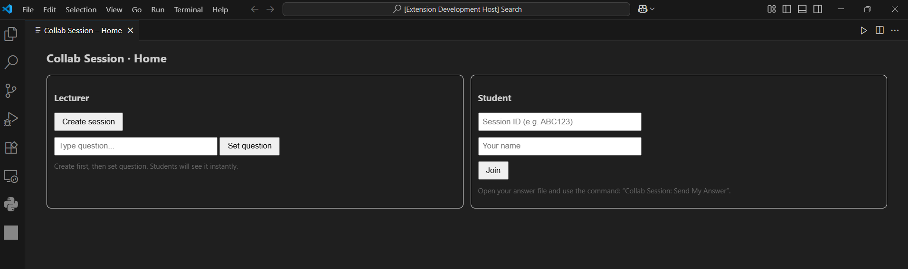  
Main home panel of the extension (create or join session).

### 4. Create Session (Host)
  
Host creating a new session.

  
Session created successfully and session ID is displayed and copied to clipboard automatically..

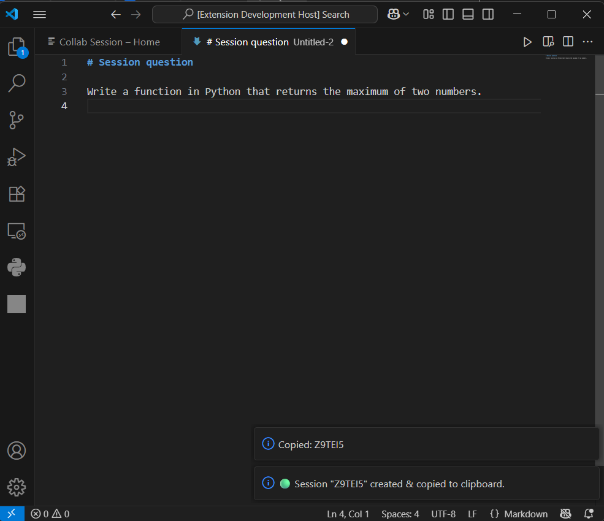  
Copy the session ID manually to clipboard.

### 5. Join Session (Students)
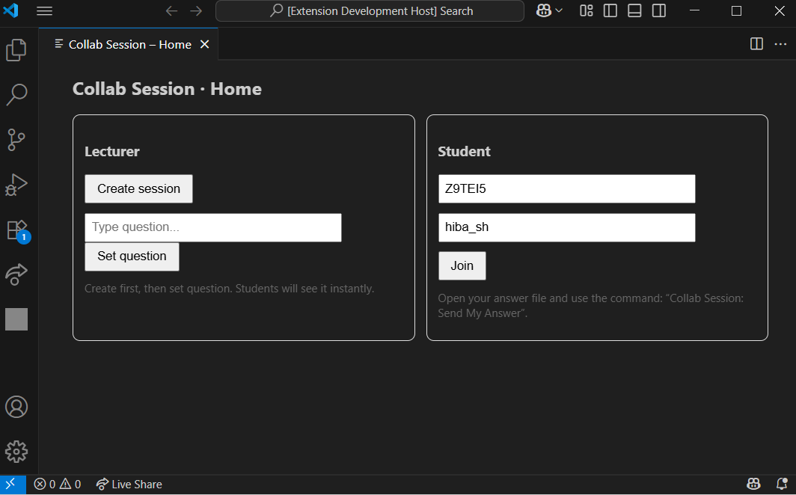  
Student joining a session by entering ID and name.

  
Confirmation when a student joins the session.

### 6. Student Answer Flow
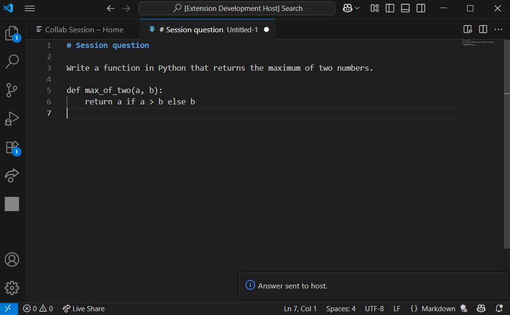  
Student sending their code answer to the host.

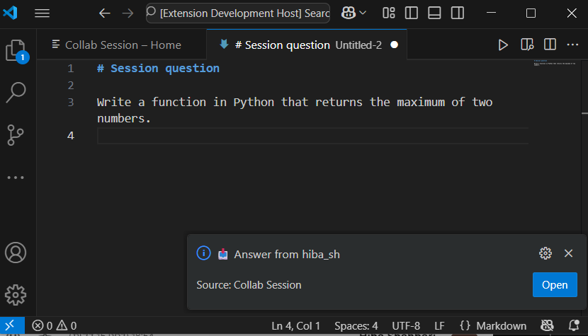  
Host receives an answer from a student.

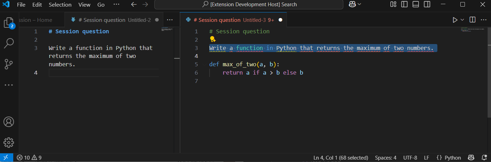  
Host viewing another student’s answer.

### 7. Feedback Flow
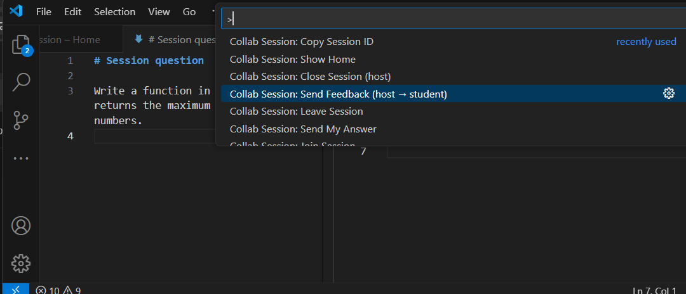  
Host writing feedback for a student.

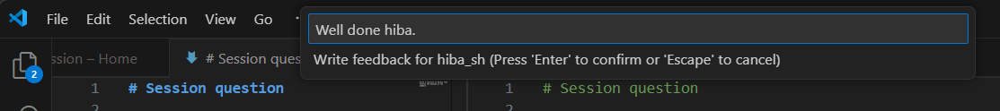  
Feedback window for sending comments to students.

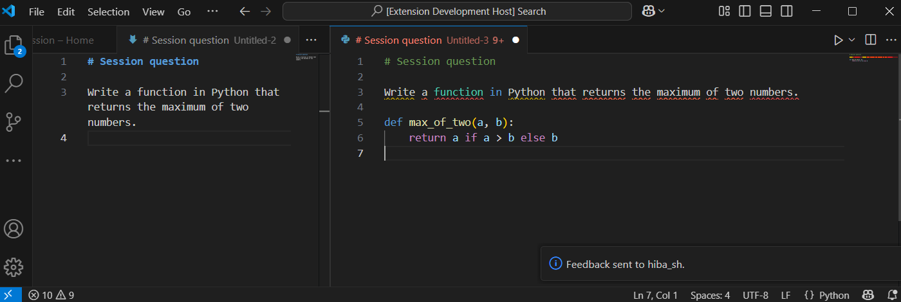
Feedback sent to the student.

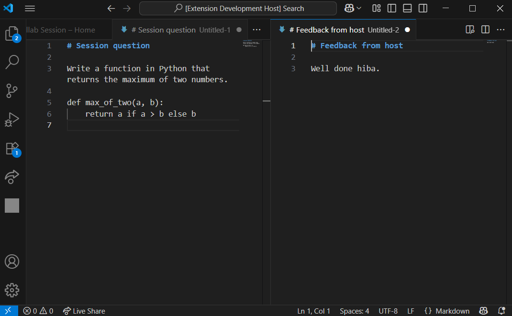
Feedback tab opened on the student’s side.

### 8. Online Users
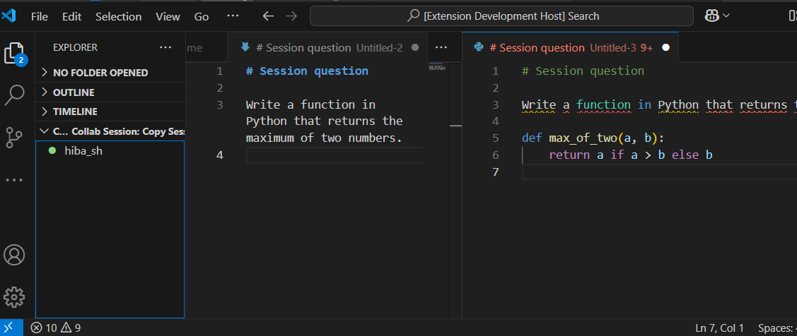  
List of currently connected users.

### 9. Session Management
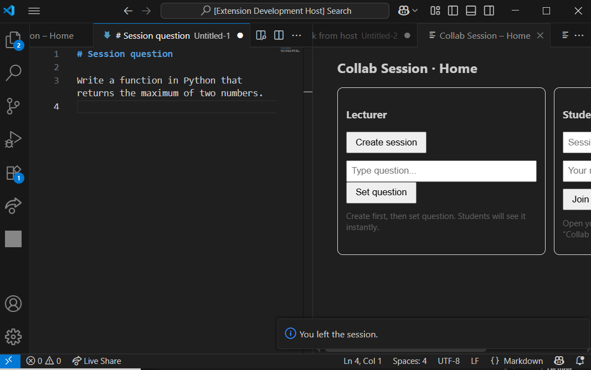  
Student leaving the session.

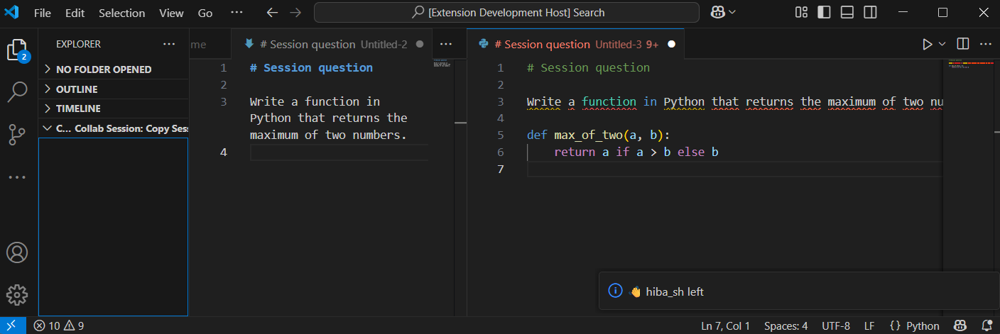  
Notification when a user leaves the session.

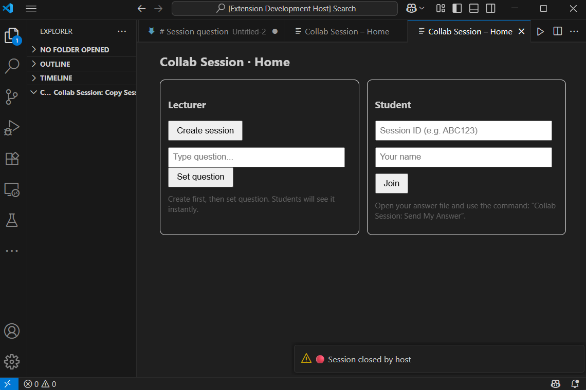  
Host closing the session.

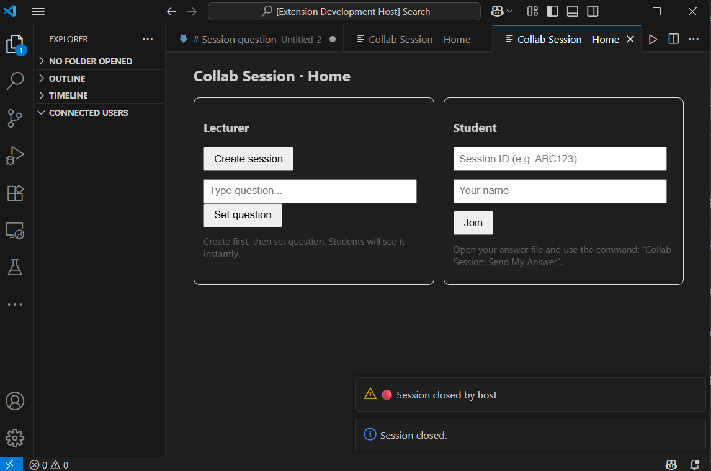  
Notification that the session has been closed.
