# Collab Session – Real-time Code Sharing in Class

A **Visual Studio Code extension** with a **Node.js WebSocket backend** that enables **lecturers** to host live coding sessions and **students** to participate in real time.

---

## 🚀 Overview

**Collab Session** allows seamless collaboration between host and students during coding classes.

### Key Features
- 🧑‍🏫 **Host** can create and manage live sessions.  
- 👩‍🎓 **Students** can join, edit code, and submit answers.  
- 🔄 **Real-time synchronization** of questions and submissions.  
- 💬 **Feedback system** between host and students.  
- 📡 Works on LAN (IPv4) or via ngrok for remote use.

---

## ⚙️ Requirements
- [Node.js](https://nodejs.org/) (v18 or later)  
- [Visual Studio Code](https://code.visualstudio.com/)  

---

## 🧩 Installation & Setup

### 1️⃣ Start the WebSocket Server
Run the server from the project root:

#### • Windows PowerShell / Linux / macOS
```bash
node server.js

---

The server starts by default on ws://localhost:3000

> 💡 You can update the Host IP anytime from VS Code using the command:  
> `Collab Session: Set Host IP` (e.g. `192.168.x.x`)


### 2️⃣ Launch the Extension
1. Open the project folder in **VS Code**.  
2. Press **F5** to run the extension.  
3. A new VS Code window will open *(Extension Development Host)*.  
4. The **Home** panel loads automatically.

---

## 🧠 How It Works

### 👨‍🏫 Lecturer (Host)
1. Create a new session → session ID is automatically copied to clipboard.  
2. Share the session ID with students.  
3. Type a question and send it to all participants.  
4. View submitted answers and provide feedback.  
5. Close the session when finished.

---

### 👩‍🎓 Students
1. Join using the **Session ID** and your **name**.  
2. Open your **“My Answer”** tab to write code.  
3. Click **Send My Answer** (or use the toolbar button).  
4. View received feedback from the host.


## 💻 Commands (Command Palette)

| Description | Role | Command |
|--------------|------|----------|
| Opens main control panel | All | `Collab Session: Show Home` |
| Creates a new session | Host | `Collab Session: Create Session` |
| Joins existing session | Student | `Collab Session: Join Session` |
| Sends a coding question | Host | `Collab Session: Set Question` |
| Sends current file to host | Student | `Collab Session: Send My Answer` |
| Opens a student submission | Host | `Collab Session: Open Student Answer` |
| Sends feedback to a student | Host | `Collab Session: Send Feedback` |
| Copies active session ID | Host | `Collab Session: Copy Session ID` |
| Leaves the current session | Student | `Collab Session: Leave Session` |
| Ends the active session | Host | `Collab Session: Close Session` |

> 🖥️ **Default configuration:** uses `ws://localhost:3000`  
> 🌐 For multi-device use, replace `localhost` with your machine’s **IPv4**.


## 🖼️ Screenshots
---

```md
### ⚙️ 1. Run the Server
Open the terminal in your project folder and run:
```bash
node server.js

---

### 2. Run the Extension  
Open the project in **VS Code** and press **F5** to start the extension.  

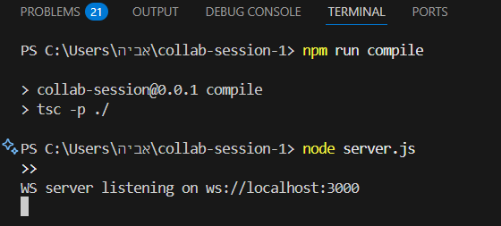

---

### 3. Home Panel  
Displays the **Lecturer** and **Student** sections with session management tools.  

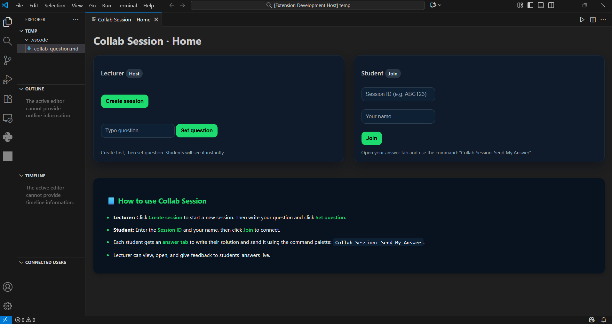

---

### 4. Create Session (Host)
Click **Create Session** to generate a unique session ID for the host.  
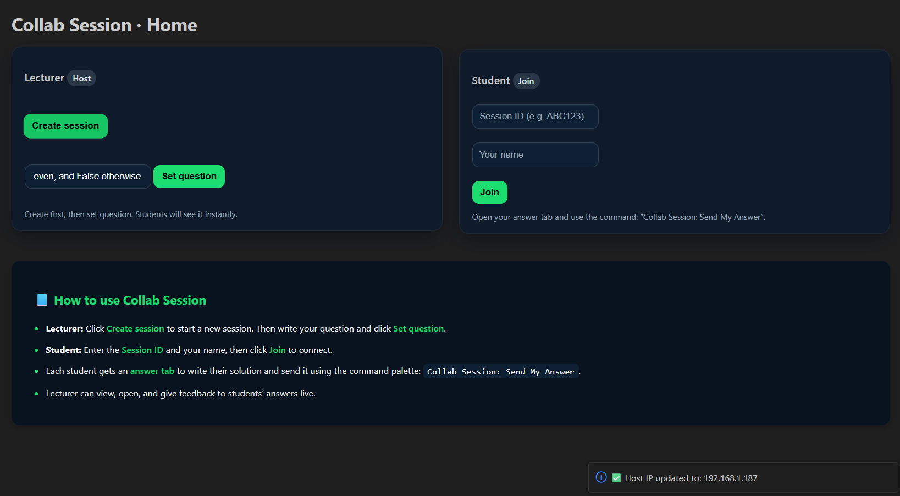  
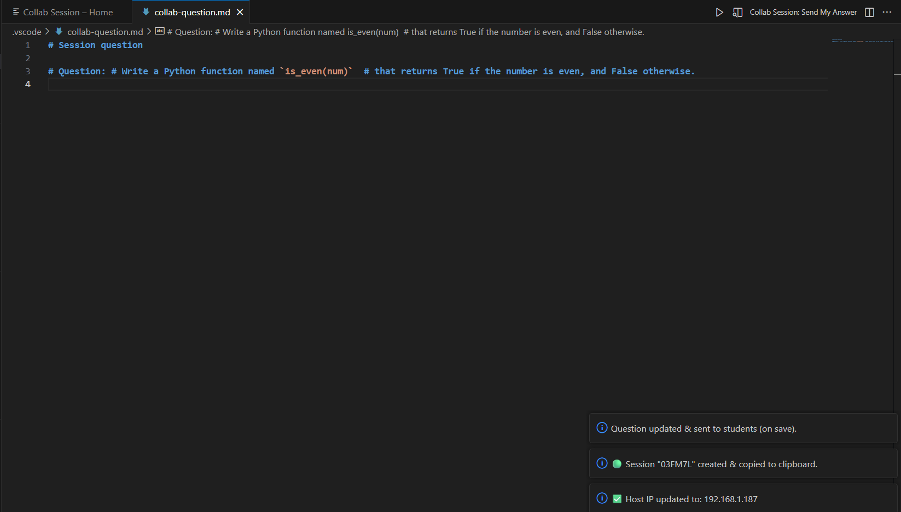

---

### 5. Join Session (Student)
Students enter the **Session ID** and their **name** to connect instantly.  
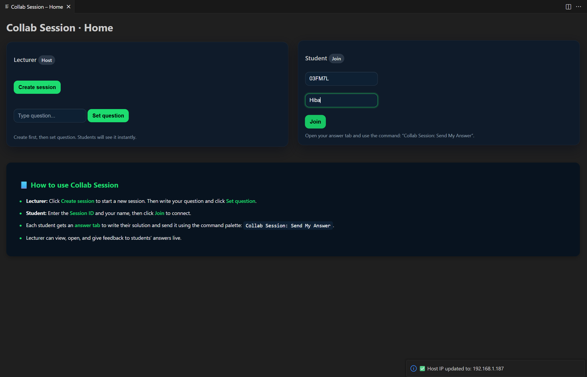  
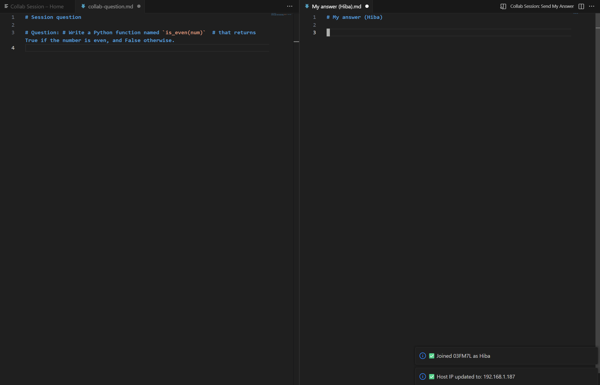

---

### 6. Send Answer (Student)
Students submit their code using the command **"Collab Session: Send My Answer"**.  
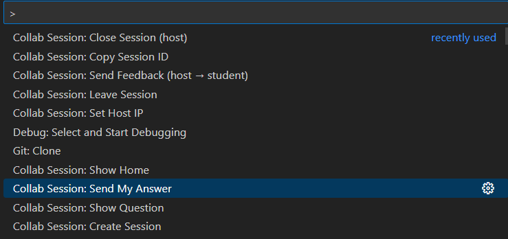
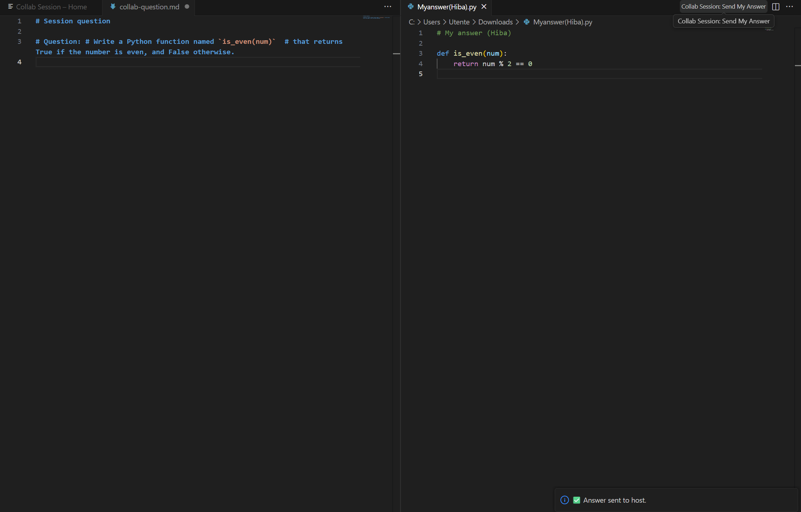

---

### 📥 7. Receive Answers (Host)
Host receives students’ answers instantly and can open them directly.
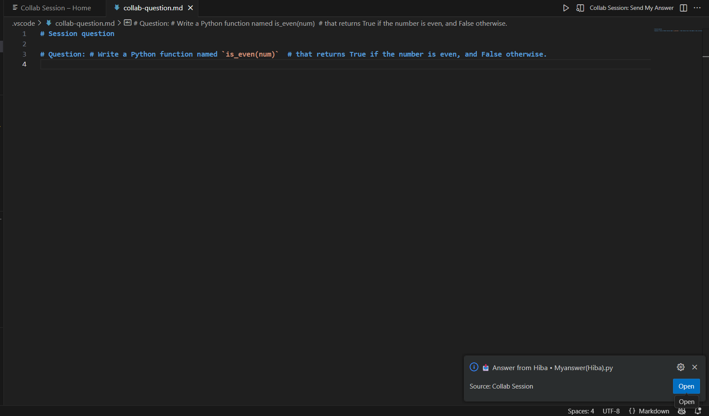
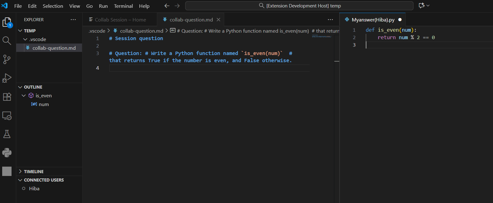

---

### 8. Feedback Flow  
Host reviews submissions and sends feedback directly to students.  

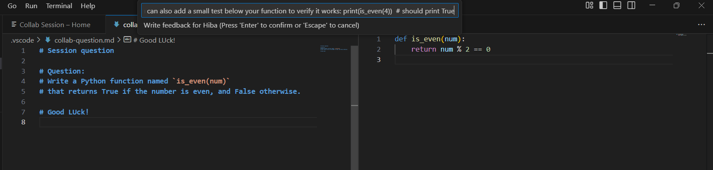
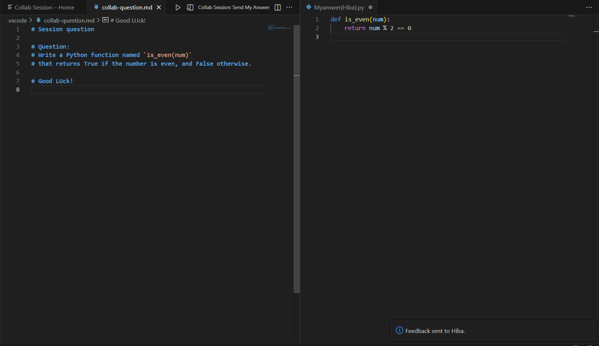


---

### 🚪 9. Leave Session (Student)
Students can leave the session anytime using the command:  
`Collab Session: Leave Session`

When a student leaves, the host receives a notification in the bottom corner.

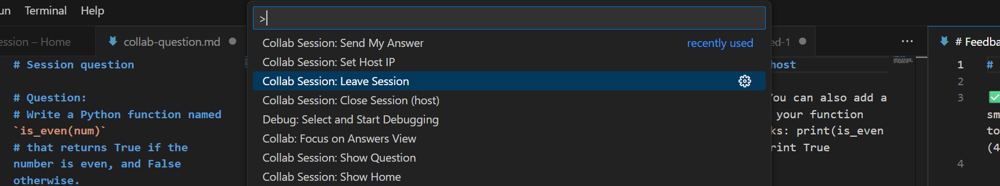

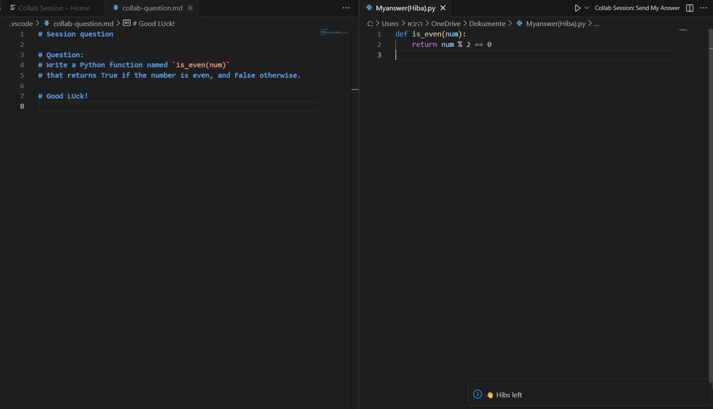

---

### 🛑 10. Close Session (Host)
The lecturer (host) can close the session when finished.  
All connected students will automatically return to the Home panel and see a warning message.

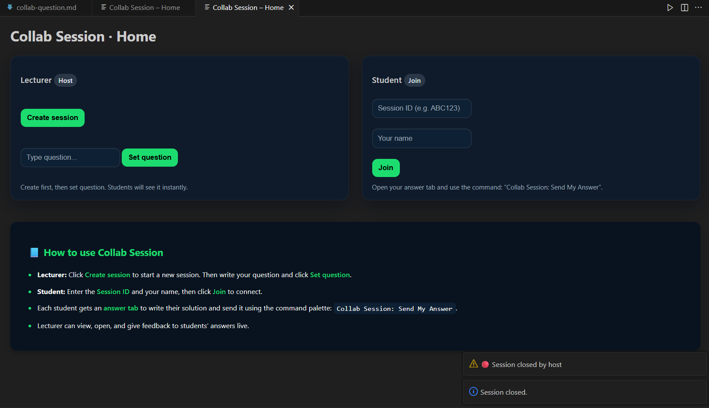

---

---

## 🗄️ 11. Database Overview

This section shows real data saved in **collab.db** after multiple test sessions.  
It includes session records, connected members, questions, answers, and feedback exchanges between host and students.

### 📊 1. Sessions & Members  
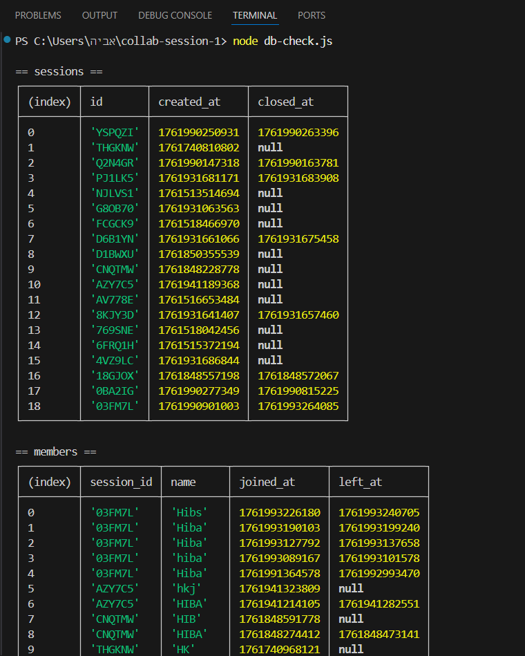

### 📝 2. Questions Table  
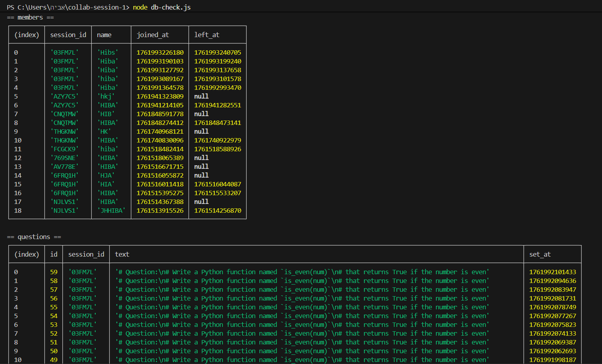

### 💬 3. Answers Table  
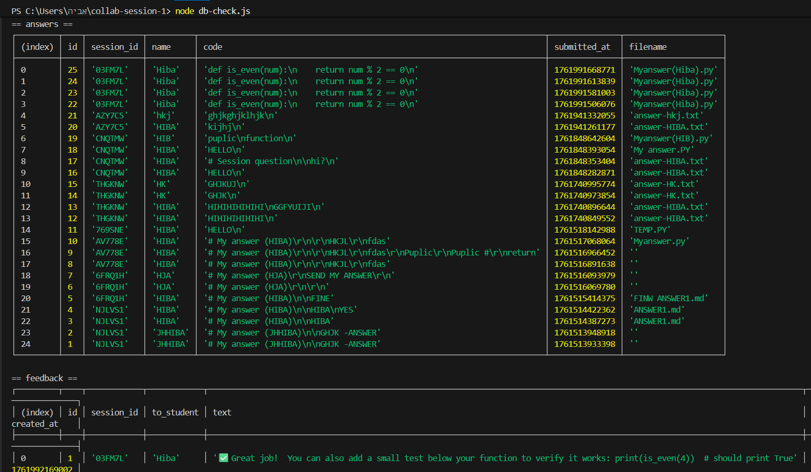

### 🧠 4. Feedback & Tables Overview  
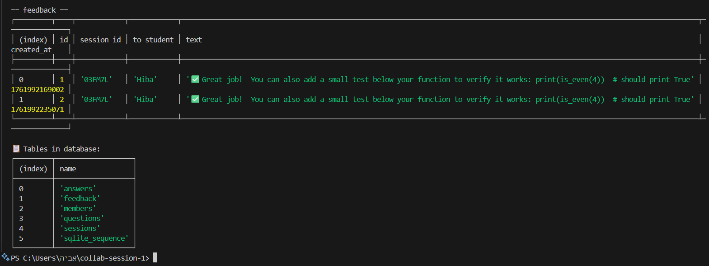

---

> 💡 These tables were generated using:
> ```bash
> node db-check.js
> ```
> This command prints all database contents directly from `collab.db` in a readable table format.
